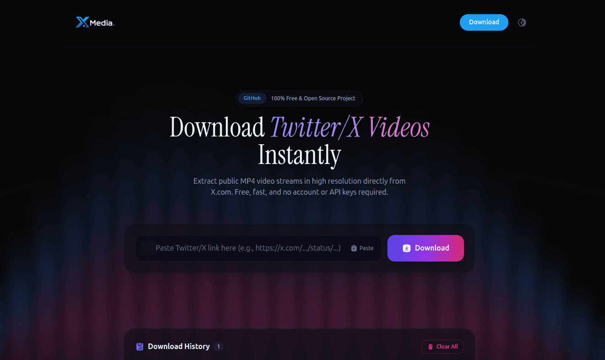

# X-Media Downloader

<p align="center">
  
</p>

X-Media Downloader is a premium, full-stack, glassmorphic web application built with **React, Express, and TypeScript** that extracts direct, downloadable MP4 video stream URLs from public Twitter/X posts. 

This project does not use the official Twitter API. Instead, it leverages a reverse-engineered token calculation and queries the public Twitter Syndication API, replicating the behavior of official embedded web widgets.

## Key Features

- **High-End Design System**: Modern Glassmorphic UI with dynamic animated gradients, customizable dark/light themes, and custom animations utilizing Framer Motion.
- **Micro-Animations**: Smooth scale changes, sliding cards, and audio-style loading equalizers.
- **Multiple Video Resolutions**: Extracts and displays all available MP4 resolutions (e.g., `1080p`, `720p`, `480p`, `360p`) sorted by quality.
- **Interactive Video Preview**: Directly preview the video in a premium player before downloading.
- **Download History**: Stores past downloads in the browser's `LocalStorage` with quick-reload, individual deletion, and history wipe controls.
- **Quick-Copy Stream Links**: Direct buttons to copy raw CDN links or copy the post URL.
- **Advanced Backend Protections**: Integrates helmet security headers, custom logging, and rate limiting (max 30 download requests/15 mins per IP).
- **TypeScript Everywhere**: Strong types on both frontend and backend for robust, type-safe execution.

## Project Directory Structure

```
X-Downloder/
├── client/                     # Frontend Application (Vite + React + TS)
│   ├── src/
│   │   ├── components/         # Reusable glassmorphic UI components
│   │   │   ├── ThemeToggle.tsx      # Animating Dark/Light switch
│   │   │   ├── DownloadForm.tsx     # Link pasting, validating form
│   │   │   ├── VideoResult.tsx      # Video player, resolutions, download links
│   │   │   ├── HistoryPanel.tsx     # Local history panel list
│   │   │   └── LoadingSkeleton.tsx  # Shimmer loading layout
│   │   ├── hooks/              # Custom state management hooks
│   │   │   ├── useTheme.tsx         # Dark/Light theme coordinator
│   │   │   └── useHistory.tsx       # LocalStorage downloader history
│   │   ├── services/           # Networking and API calling
│   │   │   └── api.ts               # Backend connector
│   │   ├── utils/              # Helper utilities
│   │   │   └── helpers.ts           # Duration and timestamp formatters
│   │   ├── App.tsx             # Assembly, layout & toast provider
│   │   ├── index.css           # Tailwind directives & glass panel styles
│   │   └── main.tsx            # Entrypoint
│   ├── tailwind.config.js      # Darkmode / glassmorphic extension config
│   ├── postcss.config.js
│   └── package.json
│
├── server/                     # Backend API Server (Node + Express + TS)
│   ├── src/
│   │   ├── controllers/        # Request handling and validators
│   │   │   └── download.ts          # POST /api/download controller
│   │   ├── routes/             # Route mapping
│   │   │   └── download.ts          # Downloader router
│   │   ├── services/           # Downloader core scraper logic
│   │   │   └── twitter.ts           # Syndication crawler & URL parser
│   │   ├── middleware/         # Express filters
│   │   │   └── rateLimiter.ts       # Route-specific rate limits
│   │   ├── utils/              # Base-36 tokens & loggers
│   │   │   ├── token.ts             # Validation token formula
│   │   │   └── logger.ts            # Colored timestamp logs
│   │   └── index.ts            # Server bootstrap
│   ├── tsconfig.json           # Compiler rules
│   └── package.json
│
└── README.md                   # Setup, architecture & deployment guide
```

---

## How the Scraper Works (Educational Context)

The backend scraper circumvents the need for developer API keys by querying the same endpoint Twitter uses to deliver embedded tweets to third-party websites: `https://cdn.syndication.twimg.com/tweet-result?id={tweetId}&token={token}`.

### Token Calculation
The `token` parameter is mandatory for this endpoint to return data. It is calculated by a specific formula matching the tweet's Snowflake ID:
$$\text{token} = \text{sanitize}\left(\text{base36}\left(\frac{\text{tweetId}}{10^{15}} \times \pi\right)\right)$$

In TypeScript, this is implemented as:
```typescript
export function getToken(id: string): string {
  const numId = Number(id); // Mimics JS float precision loss
  return ((numId / 1e15) * Math.PI)
    .toString(36)
    .replace(/(0+|\.)/g, ''); // Strip periods and zeroes
}
```

### Media Parsing
The endpoint returns a structured JSON payload. The backend parses `mediaDetails` to find an item with `type === "video"` or `type === "animated_gif"`. The streams are found in the `video_info.variants` array, which we filter for `content_type === "video/mp4"` and sort by bitrate to deliver organized resolution outputs (like `720p`, `480p`).


## Local Installation & Setup

### Prerequisites
- Node.js (v18.x or later recommended)
- npm or yarn

### 1. Setup Backend Server
```bash
# Navigate to server
cd server

# Install dependencies
npm install

# Create environment file
cp .env.example .env

# Start development server
npm run dev
```
The server will start on `http://localhost:5000`.

### 2. Setup Frontend Client
In a new terminal window:
```bash
# Navigate to client
cd client

# Install dependencies
npm install

# Start Vite dev server
npm run dev
```
The application will launch on `http://localhost:5173`. Open this URL in your web browser.


## Environment Variables

### Backend Server (`server/.env`)
| Variable | Description | Default |
| :--- | :--- | :--- |
| `PORT` | The port the Express server listens on. | `5000` |
| `NODE_ENV` | Running mode (`development` or `production`). | `development` |
| `CORS_ORIGIN` | Allowed origin for cors request (frontend URL). | `http://localhost:5173` |

### Frontend Client (`client/.env`)
By default, the client points to `http://localhost:5000` for API requests. To change this, create a `.env` file:
```env
VITE_API_URL=http://localhost:5000
```


## Deployment Instructions

### 1. Deploying the Backend on Render
1. Sign in to [Render](https://render.com/).
2. Click **New +** and select **Web Service**.
3. Connect your GitHub repository.
4. Set the following options:
   - **Root Directory**: `server`
   - **Environment**: `Node`
   - **Build Command**: `npm install && npm run build`
   - **Start Command**: `npm start`
5. Under **Advanced**, add your Environment Variables:
   - `NODE_ENV`: `production`
   - `PORT`: `10000` (or whatever Render injects)
   - `CORS_ORIGIN`: `https://your-frontend-vercel-url.vercel.app`
6. Click **Create Web Service**. Note down the backend URL (e.g., `https://x-downloader-api.onrender.com`).

### 2. Deploying the Frontend on Vercel
1. Sign in to [Vercel](https://vercel.com/).
2. Click **Add New** > **Project** and import your repository.
3. In the project settings, set:
   - **Root Directory**: `client`
   - **Framework Preset**: `Vite`
   - **Build Command**: `npm run build`
   - **Output Directory**: `dist`
4. Add the Environment Variable:
   - `VITE_API_URL`: `https://your-backend-api-url.onrender.com` (Your Render backend URL, without a trailing slash)
5. Click **Deploy**.


## Contributing

Contributions are welcome! Please feel free to submit a Pull Request.

## License

This project is licensed under the [MIT License](LICENSE).

---

<div align="center">
   
⭐ If you find this project useful, please give it a star!

**Built with ❤️ by [Dhrubaraj Pati](https://codewithdhruba.in/) for developers**

[Website](https://codewithdhruba.in/) • [GitHub](https://github.com/codewithdhruba01) • [Twitter](https://x.com/codewithdhruba)

</div>